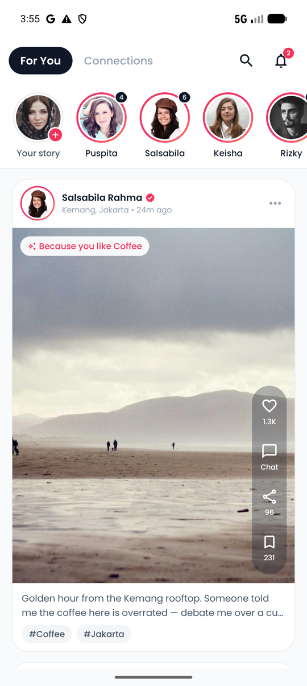
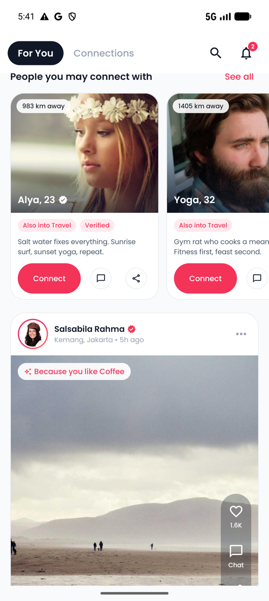
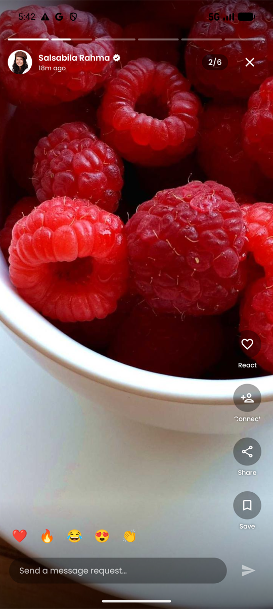
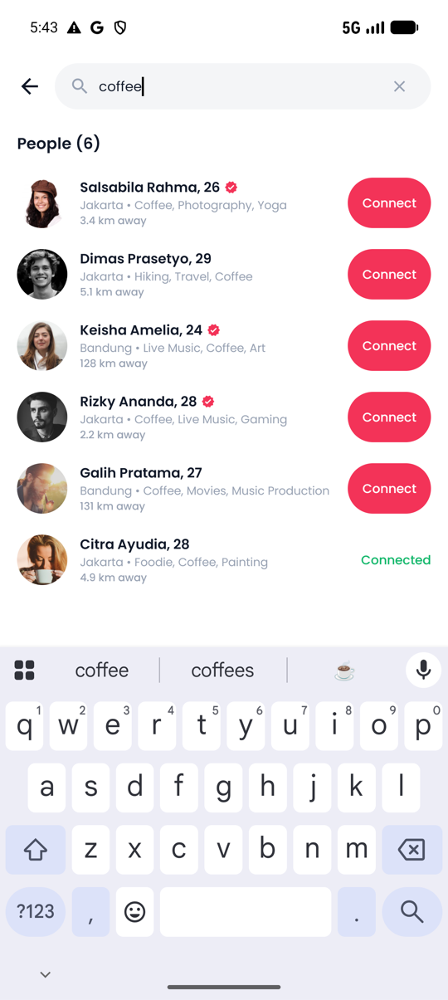
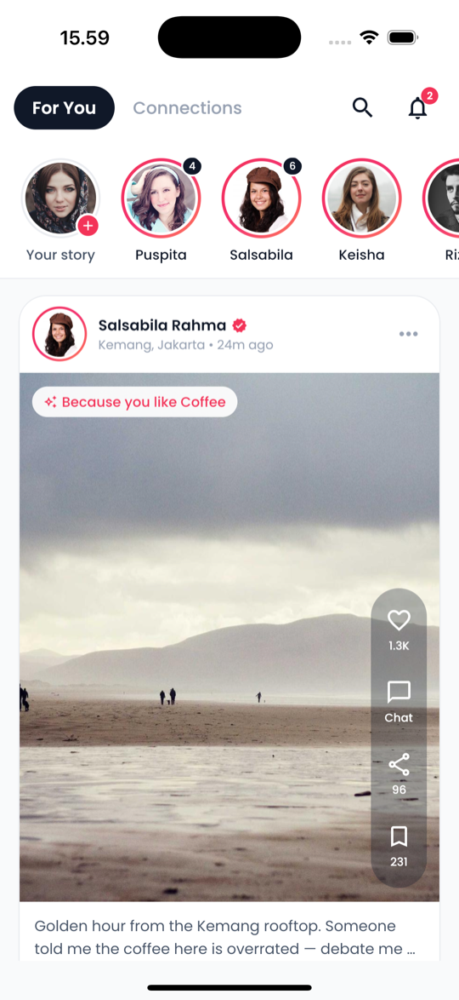
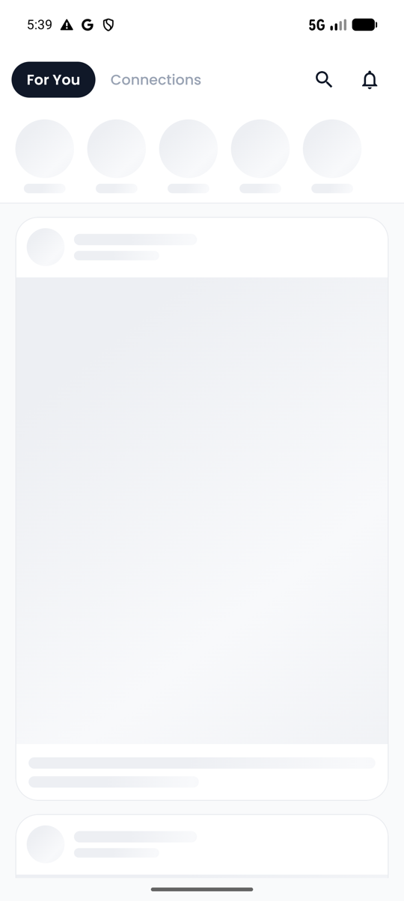
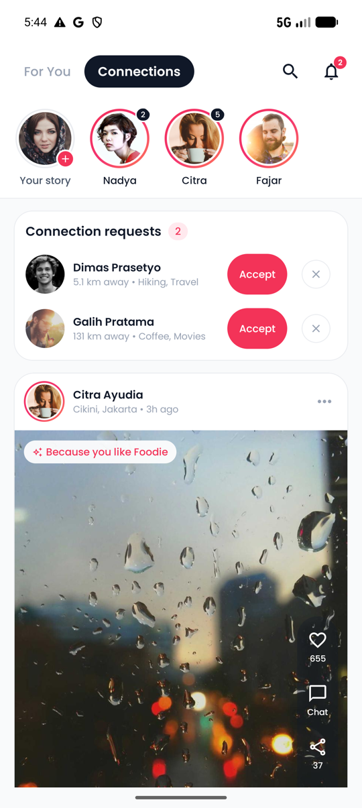
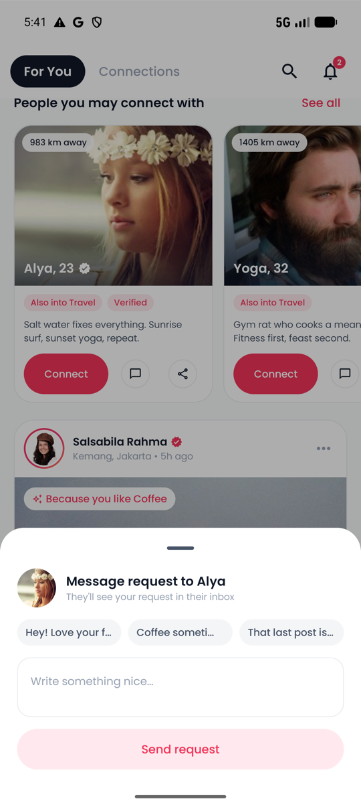
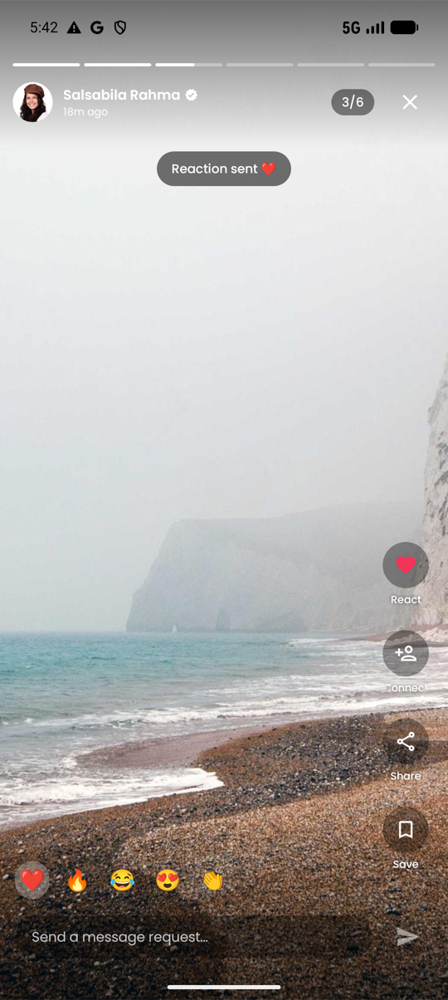

# Lovorise Discover — Front-End Test Task (Compose Multiplatform)

A redesigned **Discover/Home** experience for the Lovorise mobile app, built with **Kotlin + Compose Multiplatform** so the entire UI, data and recommendation logic ship to **Android and iOS from one shared codebase**. The goal: keep the Lovorise design language (sampled directly from the production app) while fixing the usability gaps of the current Discover module and turning it into a richer, content-first feed.

| Home (For You) | Recommendations | Story Viewer (2/6) | Search |
|---|---|---|---|
|  |  |  |  |

**One codebase, two platforms** — the exact same `commonMain` UI running on an iPhone 16 Pro simulator:



---

## 1. UX review of the current Discover

I explored the production build (`com.lovoriseapp`) on an emulator before writing any code. Findings that drove this redesign:

| Observation in current app | Impact | What this build does instead |
|---|---|---|
| Discover is a full-screen, one-profile-per-swipe pager | Very low information density; discovery is slow and repetitive | Scrollable feed mixing **content posts, stories and profile recommendations** — more ways to discover people than a single photo |
| **Connections tab shows "Coming Soon"** | Half of the header navigation is dead | Fully working Connections tab: pending **request strip (Accept/Decline)** + posts and stories from connected users only |
| **No search anywhere** on Discover | Users can't act on intent ("find someone into hiking") | Dedicated Search flow with recent searches, suggested users and instant local filtering |
| No stories or user-generated content | Nothing to come back for; profiles feel static | Stories rail (single & multi-image with count badges + seen states) and lifestyle feed cards |
| Action rail icons (like/gift/share) show bare counters with no context | Unclear affordances | Labeled, animated actions — React, Message request, Share, Save — with live counters |
| No explanation of *why* a profile is shown | Recommendations feel random | Every card carries **"why you see this" chips** ("Near you", "3 shared interests", "Because you like Coffee", "Active now") |

**Kept from the existing design language:** brand pink `#F33358` (sampled), ink `#101828`, surface `#EAECF0`, Poppins typography, pill-shaped buttons and tabs, the dark "For You" pill header, initials-avatar fallback with the same muted palette, and the right-side action rail DNA from the current swipe view.

## 2. Requirements coverage

- **Top header** — `For You` (default) / `Connections` pills with animated active state, Search icon → Search screen, Notification icon (UI-only) with badge.
- **Search flow** — auto-focused input, recent searches (dummy, removable + clear-all), suggested users from the recommendation engine, **local filtering** across name / city / bio / interests, back navigation. Connect state stays in sync with the feed.
- **Stories** — horizontal rail; single and multi-image stories; unseen gradient ring → gray when seen; multi-image count badge; full-screen viewer with segmented auto-advance progress, tap prev/next, hold-to-pause, swipe-down dismiss and **`2/6` pagination**; actions: React (emoji quick reactions), Add Connection, Share, Message (reply field → message request), Save.
- **Profile cards** — "People you may connect with" modules woven into the feed: photo, name/age, verified, distance, active dot, bio, match-reason chips; **Add Connection Request** (→ Requested), **Send Message Request** (bottom sheet with quick messages), **Share Profile** (native share sheet on both platforms).
- **Feed cards** — author header (avatar with story ring → opens story), 4:5 media, expandable caption, tag chips, double-tap to react with heart burst.
- **Action sidebar** — React / Message request / Share / Save overlaid on media with animated counters (spring scale on toggle, sliding counter).
- **Feed behavior** — infinite scroll against the paged mock API with a footer loader, pull-to-refresh, stories & profile recommendations naturally interleaved (a module every 4 posts).
- **Content recommendation (simulated)** — see below.
- **Mock API integration using JSON** — `composeResources/files/mock/{users,stories,posts}.json` read by `MockApi` with simulated latency (~750 ms) and infinite paging (later pages cycle the catalogue with fresh ids and jittered engagement).

### Recommendation simulation

`RecommendationEngine` scores every profile for the viewer (a Jakarta-based persona defined in `users.json`) and keeps human-readable reasons:

| Signal | Scoring |
|---|---|
| Location | same city +30 ("Near you"), same country +12, distance decay up to +18 |
| Interests | +12 per shared interest (cap 36) → "N shared interests" |
| Profile info | verified +8, has photo +4, meaningful bio +3 |
| Recent activity | ≤20 min +15 ("Active now"), ≤3 h +8, ≤24 h +3 |

Posts are ranked by `0.6 × author affinity + freshness (log decay) + engagement (log) + tag-interest bonus`, and each post derives a reason chip. Ranked recommendations are interleaved into the feed (`interleave(every = 4, chunkSize = 3)`) and rotate across pages so modules don't repeat.

### Bonus items

- **Skeleton loading** — shimmer stories + feed cards on first load (honest, latency-driven).
- **Swipe gestures** — double-tap to react, story tap zones / hold-to-pause / swipe-down dismiss, horizontal story paging.
- **Smooth animations** — animated tab pills, spring heart burst, scale-bounce action icons, sliding counters, expandable captions with `animateContentSize`, screen transitions (search slides in, story rises from bottom).

## 3. Architecture

**Compose Multiplatform (Android + iOS)** — MVVM + unidirectional data flow. All UI, view models, data and recommendation logic live in `shared/commonMain`; the platform layers are thin entry points plus two `expect`/`actual` seams.

```
shared/src
├── commonMain/kotlin/com/lovorise/discover
│   ├── core/
│   │   ├── designsystem/          # Color tokens, Poppins type scale, theme, shared components
│   │   │   └── components/        #   Avatar (initials fallback + story ring), pill buttons, shimmer
│   │   ├── platform/ShareText.kt  # expect: native share sheet
│   │   └── util/                  # count/time/distance formatters
│   ├── data/
│   │   ├── model/                 # @Serializable DTOs + FeedItem sealed UI model
│   │   ├── source/MockApi.kt      # JSON "endpoints" (compose resources) with latency + paging
│   │   ├── recommend/             # RecommendationEngine (pure Kotlin, unit-tested)
│   │   ├── search/                # UserSearchFilter (pure Kotlin, unit-tested)
│   │   └── repo/DiscoverRepository.kt  # catalogue cache + SessionState (single source of truth)
│   ├── feature/
│   │   ├── home/                  # HomeViewModel + HomeScreen + components (header, stories,
│   │   │   └── components/        #   feed card, action rail, profile recs, requests, skeletons…)
│   │   ├── search/                # SearchViewModel + SearchScreen
│   │   └── story/                 # StoryViewerViewModel + StoryViewerScreen
│   ├── navigation/                # Multiplatform NavHost (home / search / story/{id}) with transitions
│   ├── AppGraph.kt                # manual DI container (shared by both platforms)
│   └── App.kt                     # shared root: Coil image loader + theme + navigation
├── commonMain/composeResources/
│   ├── files/mock/                # users.json / stories.json / posts.json (mock API)
│   └── font/                      # Poppins (regular / medium / semibold / bold)
├── androidMain/                   # actual: Android share intent, OkHttp engine for Coil
├── iosMain/                       # actual: UIActivityViewController share, Darwin engine, MainViewController
└── commonTest/                    # 19 multiplatform unit tests (kotlin.test)

androidApp/                        # Android entry point (single Activity → App())
iosApp/                            # Xcode project (SwiftUI ContentView → ComposeUIViewController)
```

Key decisions:

- **`SessionState` in the repository** (immutable `data class` in a `StateFlow`) holds every interaction — reactions, saves, requested/accepted connections, seen stories, recent searches — so Home, Search and the Story viewer stay in sync automatically (accepting a request instantly adds that user's posts to the Connections feed).
- **`FeedItem` sealed interface** (`Post` / `ProfileRecs`) lets the engine hand the UI one ranked, interleaved list with stable keys for `LazyColumn` animations.
- **Story viewer snapshots the story order** when opened so marking stories "seen" doesn't reshuffle pager pages mid-view.
- **Platform seams are minimal**: only the share sheet (`rememberShareText`) and Coil's HTTP engine differ per platform; everything else — including fonts, mock JSON and navigation — is shared through compose resources and multiplatform androidx libraries.
- Images load with Coil 3 (Ktor engine) and degrade gracefully: shimmer while loading, brand initials-avatar / tinted placeholder when offline — the app is fully usable without network.

## 4. Tech stack

Kotlin 2.2 · Compose Multiplatform 1.9 (Material 3) · multiplatform Navigation Compose & Lifecycle ViewModel · Kotlinx Serialization · Coil 3 + Ktor · compose resources for fonts/JSON. Android minSdk 24, target/compile SDK 36 · iOS arm64 + Simulator arm64 (Xcode 16.4+).

## 5. Build & run

```bash
# Android
./gradlew :androidApp:assembleDebug
adb install -r apk/lovorise-discover-debug.apk

# iOS — open iosApp in Xcode and run, or:
open iosApp/iosApp.xcodeproj
```

- Ready-made test build: **`apk/lovorise-discover-debug.apk`**
- JDK 17+, Android SDK 36; Xcode 15+ for the iOS app. No API keys needed — data is bundled JSON; images come from picsum/pravatar when online.

## 6. Tests

`shared/src/commonTest` — 19 multiplatform tests (run on JVM and iOS simulator) covering the logic that drives the experience:

```bash
./gradlew :shared:testAndroidHostTest        # JVM
./gradlew :shared:iosSimulatorArm64Test      # iOS simulator
```

- `RecommendationEngineTest` — ranking order across location/interest/activity signals, reason generation, connected-user exclusion, interleaving positions, post ranking with tag bonus.
- `UserSearchFilterTest` — case-insensitive matching across name, city, bio and interests; blank/no-match handling.
- `DiscoverRepositoryTest` — feed-key uniqueness across pages, recommendation rotation over page boundaries, uniform page size, the Connections data-layer query, warm-up atomicity on partial failures, and message/story-save session state.

## 7. Screenshots

| Skeleton loading | Connections tab | Message request | Story reaction |
|---|---|---|---|
|  |  |  |  |

---

*Poppins is bundled under the SIL Open Font License. Dummy photos are served by picsum.photos / pravatar.cc; all names, bios and posts are fictional.*
